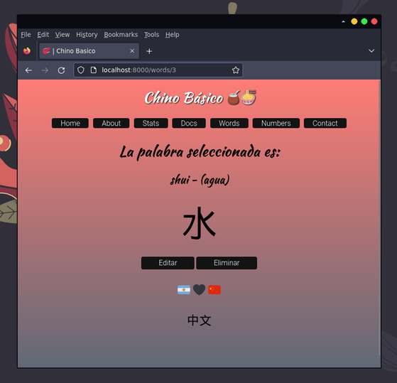

# Chino Básico
TP integrador para la materia Desarrollo Web Backend usando el framework Django (Python). La idea es mostrar los principios del idioma Chino.

A través de vistas personalizadas, el usuario administrador puede hacer uso del ABM de palabras y de números. Luego las palabras o los números cargados se muestran en una ruta basada en su id. En el caso que se ve en el screenshot: `/words/3`, que representa la palabra "agua".